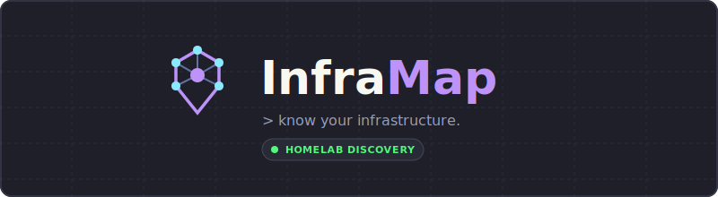

<a id="readme-top"></a>

<!-- PROJECT BANNER -->
<p align="center">
  
</p>

<!-- PROJECT LOGO & BADGES -->
<br />
<div align="center">
  <p align="center">
    The ultimate homelab infrastructure management, automated discovery, and topology mapping engine.
    <br />
    <a href="docs/project-foundation.md"><strong>Explore the Docs »</strong></a>
    <br />
    <br />
    <a href="https://github.com/matheussouza/inframap/issues/new?labels=bug">Report Bug</a>
    &middot;
    <a href="https://github.com/matheussouza/inframap/issues/new?labels=enhancement">Request Feature</a>
  </p>
  <br />
  
  
  
  <a href="LICENSE"></a>
</div>

<!-- TABLE OF CONTENTS -->
<details>
  <summary>Table of Contents</summary>
  <ol>
    <li>
      <a href="#about-the-project">About The Project</a>
      <ul>
        <li><a href="#built-with">Built With</a></li>
        <li><a href="#core-principles">Core Principles</a></li>
      </ul>
    </li>
    <li>
      <a href="#getting-started">Getting Started</a>
      <ul>
        <li><a href="#prerequisites">Prerequisites</a></li>
        <li><a href="#installation">Installation</a></li>
      </ul>
    </li>
    <li><a href="#auto-updates--zero-data-loss">Auto-Updates & Zero Data Loss</a></li>
    <li><a href="#architecture-and-rfcs">Architecture and RFCs</a></li>
    <li><a href="#roadmap">Roadmap</a></li>
    <li><a href="#license">License</a></li>
  </ol>
</details>

<!-- ABOUT THE PROJECT -->
## About The Project

InfraMap is an open-source, homelab-first infrastructure management system. It provides automated device discovery, topology mapping, and a strict "Zero Data Loss" inventory system to help you visualize, track, and manage your entire network and service stack.

Designed specifically for homelabs and small-scale infrastructure, InfraMap integrates seamlessly with providers like Proxmox VE, Docker Engine, UniFi, and SNMP devices to continuously reconcile the state of your network.

### Core Principles

* **Self-Contained Single Binary (Portainer-Style):** The WASM frontend is embedded directly into the Go backend binary (`embed.FS`). A single process/container serves both the REST/SSE API and the UI.
* **Zero Data Loss:** Hard deletions are strictly prohibited. Everything is soft-deleted, versioned, and fully auditable.
* **Automated Startup Migrations:** On container update or restart, pending Goose database migrations execute automatically inside isolated database transactions before serving traffic.
* **Resilient Integrations:** All external integrations run in isolated contexts with circuit breakers and strict 30-second timeouts. A failing provider will never crash the core engine.

### Built With

* **Backend:** [Go](https://go.dev/) (1.25+)
* **Database:** [PostgreSQL 17](https://www.postgresql.org/) (pgx & sqlc for type-safe queries)
* **Migrations:** [Goose](https://github.com/pressly/goose) (Automated startup migrations)
* **Frontend:** [Kotlin Compose Multiplatform (WASM)](https://www.jetbrains.com/lp/compose-multiplatform/) embedded via Go `embed.FS`

<!-- GETTING STARTED -->
## Getting Started

InfraMap is fully self-contained. A single command spins up the database, automatically applies migrations, and launches the unified backend and embedded frontend.

### Prerequisites

* [Docker & Docker Compose](https://www.docker.com/)
* [Go 1.25+](https://go.dev/dl/)
* Make

### Installation

1. Clone the repo:
   ```sh
   git clone https://github.com/matheussouza/inframap.git
   cd inframap
   ```

2. Run the single self-contained development environment:
   ```sh
   make dev
   ```

3. Open `http://localhost:8055` in your browser (configurable via `INFRAMAP_PORT`).

<!-- AUTO-UPDATES & ZERO DATA LOSS -->
## Auto-Updates & Zero Data Loss

InfraMap is designed for zero-friction homelab maintenance. You can safely configure auto-updater agents like **Watchtower** or run `docker compose pull` on the `:latest` tag:

* **Automatic Schema Upgrades:** Upon container restart with a newer version, InfraMap automatically executes any pending Goose database migrations before opening network ports.
* **Transaction Safety & Rollbacks:** Every migration runs inside a PostgreSQL transaction. If a migration fails, the transaction rolls back cleanly, preventing data corruption and keeping your existing database intact.
* **Backward Compatibility:** Database schema changes strictly follow additive (Expand-Contract) patterns. Updates will never drop data or break historical records.

<!-- ARCHITECTURE AND RFCS -->
## Architecture and RFCs

Every major architectural decision, data model, and API contract is extensively documented in our RFCs and Domain Context:

* [CONTEXT.md](CONTEXT.md) — Domain Glossary & Ubiquitous Language Definition
* [ADR-001: Architectural Decisions](docs/adr/ADR-001-architectural-decisions.md) — Log of Active Architectural Decisions
* [RFC-001: Technology Stack](docs/RFC-001-technology-stack.md)
* [RFC-002: Development Workflow](docs/RFC-002-development-workflow.md)
* [RFC-003: Quality Gates](docs/RFC-003-quality-gates.md)
* [RFC-004: Security Policy](docs/RFC-004-security-policy.md)
* [RFC-005: Architecture](docs/RFC-005-architecture.md)
* [RFC-006: Data Model](docs/RFC-006-data-model.md)
* [RFC-007: Discovery Engine](docs/RFC-007-discovery-engine.md)
* [RFC-008: API Specification](docs/RFC-008-api-specification.md)
* [RFC-009: Integration SDK & Event Bus](docs/RFC-009-integration-sdk-event-bus.md)
* [RFC-010: Repository Scaffolding](docs/RFC-010-repository-scaffolding.md)

*See the [docs/](docs/) folder for the full documentation set.*

<!-- ROADMAP -->
## Roadmap

The project is currently moving from the **Foundation** phase to the **Scaffolding** phase.

See the [ROADMAP.md](ROADMAP.md) file for a complete list of upcoming features, modules, and integrations.

<!-- LICENSE -->
## License

Distributed under the **Apache License 2.0**. See [`LICENSE`](LICENSE) for more information.

<p align="right">(<a href="#readme-top">back to top</a>)</p>
