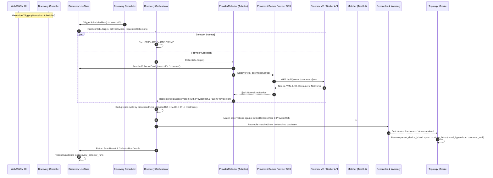

# RFC-024: Proxmox VE & Docker Engine Provider Collectors Integration

- **Status**: Proposed / Aligned (ADR-013)
- **Author**: Platform & Discovery Team
- **Date**: 2026-08-31
- **Target Release**: v0.4.0

---

## 1. Executive Summary

InfraMap discovers and visualizes heterogeneous home and lab infrastructure. While network sweeps (ICMP, ARP, mDNS, SNMP) discover active devices via Layer 2/Layer 3 probes, virtualization hosts and container runtimes (Proxmox VE, Docker Engine) manage rich, authoritative hierarchies of hypervisors, virtual machines (QEMU/KVM), and containers (LXC, Docker).

This RFC establishes the end-to-end architecture, domain contracts, database schema, matching tiers, topology hierarchy, lifecycle state transitions, and API/UI surfaces to integrate **Proxmox VE** and **Docker Engine** as first-class discovery providers within InfraMap's unified Discovery Plan engine.

---

## 2. Strategic Decisions Reference (ADR-013)

This RFC builds upon the 8 architectural decisions agreed upon in [ADR-013](file:///Users/matheussouza/git/personal/inframap/docs/adr/ADR-013-proxmox-docker-provider-collector-architecture.md):
1. **Adapter Pattern**: Use `internal/platform/sdk.Provider` for transport/parsing and wrap it in `ProviderCollector` within `modules/discovery/collectors` (single reconciliation path).
2. **Pull-Lazy Credentials**: `DiscoveryTarget` carries `SourceID uuid.UUID`; `ProviderConfigResolver` resolves and decrypts secrets lazily at execution time.
3. **Workload Identity (`ProviderRef`)**: First-class structured identity (`provider:scope:kind:native_id`) and **Tier 0** Matcher precedence.
4. **Topology Hierarchy & Re-anchoring**: `ParentProviderRef` declared by collectors, resolved in `devices.parent_device_id` and materialized in `topology_links` with atomic reparenting on VM migration.
5. **Lifecycle State Machine**: Fast-track hysteresis for authoritative providers (1st absence → `offline`, 2nd → `archived`), with scope guard-rails freezing state on partial/failed runs.
6. **Collection Scope v1**: Full structural nodes, VMs, LXCs, containers, port mappings, and networks. Volatile time-series metrics excluded from device metadata.
7. **Auto-Approval**: `auto_approve = true` by default on authenticated provider sources with volume threshold guard-rails.
8. **Unified Discovery UX**: Proxmox and Docker configured directly in Discovery Plans with dynamic credential inputs and connection test actions.

---

## 3. Architecture & Data Flow



---

## 4. Domain Model & Data Structures

### 4.1. `ProviderRef` & `ParentProviderRef` (Go Backend)

```go
package collectors

import "fmt"

// ProviderRef uniquely identifies a workload across hypervisors and container engines.
type ProviderRef struct {
    Provider string `json:"provider"` // "proxmox" | "docker" | "unifi"
    Scope    string `json:"scope"`    // "pve-cluster1" | "engine-node1"
    Kind     string `json:"kind"`     // "node" | "qemu" | "lxc" | "container"
    NativeID string `json:"native_id"`// "101" | "sha256:..."
}

func (r ProviderRef) IsZero() bool {
    return r.Provider == "" || r.NativeID == ""
}

func (r ProviderRef) Key() string {
    if r.IsZero() {
        return ""
    }
    return fmt.Sprintf("%s:%s:%s:%s", r.Provider, r.Scope, r.Kind, r.NativeID)
}

// RawObservation represents an unvalidated observation from any collector.
type RawObservation struct {
    IPAddress         string                 `json:"ip_address,omitempty"`
    MACAddress        string                 `json:"mac_address,omitempty"`
    Hostname          string                 `json:"hostname,omitempty"`
    Vendor            string                 `json:"vendor,omitempty"`
    DeviceType        string                 `json:"device_type,omitempty"`
    OperatingSystem   string                 `json:"operating_system,omitempty"`
    ProtocolSource    string                 `json:"protocol_source"`
    ConfidenceScore   int                    `json:"confidence_score"`
    ObservedAt        time.Time              `json:"observed_at"`
    ProviderRef       *ProviderRef           `json:"provider_ref,omitempty"`
    ParentProviderRef *ProviderRef           `json:"parent_provider_ref,omitempty"`
    RawMetadata       map[string]interface{} `json:"raw_metadata,omitempty"`
}
```

### 4.2. Database Schema & Migrations

Migration file: `20260901000001_provider_collectors_and_topology_hierarchy.sql`

```sql
-- +goose NO TRANSACTION
-- +goose Up

-- 1. Add containment hierarchy columns to devices
ALTER TABLE devices
    ADD COLUMN IF NOT EXISTS parent_provider_ref TEXT,
    ADD COLUMN IF NOT EXISTS parent_device_id UUID REFERENCES devices(id) ON DELETE SET NULL;

-- 2. Indexes for hierarchy resolution
CREATE INDEX CONCURRENTLY IF NOT EXISTS idx_devices_parent_device_id 
    ON devices(parent_device_id);

CREATE INDEX CONCURRENTLY IF NOT EXISTS idx_devices_parent_provider_ref_pending 
    ON devices(parent_provider_ref) 
    WHERE parent_device_id IS NULL AND deleted_at IS NULL;

-- 3. Partial unique index on ProviderRef for O(1) Tier 0 matching
CREATE UNIQUE INDEX CONCURRENTLY IF NOT EXISTS uq_devices_provider_ref 
    ON devices((metadata->>'provider_ref')) 
    WHERE deleted_at IS NULL AND metadata ? 'provider_ref';

-- 4. Clean up duplicate topology links prior to unique constraint creation
DELETE FROM topology_links
WHERE id IN (
    SELECT id FROM (
        SELECT id, ROW_NUMBER() OVER (
            PARTITION BY source_device_id, target_device_id, link_type 
            ORDER BY created_at DESC, id ASC
        ) as rnum
        FROM topology_links
    ) t
    WHERE t.rnum > 1
);

-- 5. Unique constraint on topology links to ensure idempotent containment edges
ALTER TABLE topology_links 
    DROP CONSTRAINT IF EXISTS uq_topology_links_source_target_type;

ALTER TABLE topology_links 
    ADD CONSTRAINT uq_topology_links_source_target_type 
    UNIQUE (source_device_id, target_device_id, link_type);

-- +goose Down
ALTER TABLE topology_links DROP CONSTRAINT IF EXISTS uq_topology_links_source_target_type;
DROP INDEX CONCURRENTLY IF EXISTS uq_devices_provider_ref;
DROP INDEX CONCURRENTLY IF EXISTS idx_devices_parent_provider_ref_pending;
DROP INDEX CONCURRENTLY IF EXISTS idx_devices_parent_device_id;
ALTER TABLE devices DROP COLUMN IF EXISTS parent_device_id;
ALTER TABLE devices DROP COLUMN IF EXISTS parent_provider_ref;
```

---

## 5. Reconciler & Matcher Engine (Tier 0)

### 5.1. Matching Precedence Hierarchy (RFC-007 Revision)

1. **Tier 0 (Highest Precedence)**: Exact `ProviderRef.Key()` match (`metadata->>'provider_ref'`).
2. **Tier 1**: Exact Normalized MAC address match (`mac_address`).
3. **Tier 2**: Legacy `ProviderUUID` match.
4. **Tier 3**: Serial number match (`serial_number`).
5. **Tier 4**: Combined `Hostname` + `IPAddress` match.
6. **Tier 5**: Fallback IP Address match (when confidence allows).

### 5.2. Deduplication & Cycle Keys
In `orchestrator.go`, deduplication within a discovery scan execution transitions from `processedIPs[string]bool` to `processedKeys[string]bool`:
```go
func observationDedupeKey(obs collectors.RawObservation) string {
    if obs.ProviderRef != nil && !obs.ProviderRef.IsZero() {
        return obs.ProviderRef.Key()
    }
    if obs.MACAddress != "" {
        return "mac:" + obs.MACAddress
    }
    if obs.IPAddress != "" {
        return "ip:" + obs.IPAddress
    }
    return "host:" + obs.Hostname
}
```

---

## 6. Proxmox VE & Docker Engine Provider Implementation

### 6.1. Proxmox VE Collector Specifications
- **Endpoints**:
  - `GET /api2/json/version`: Cluster connectivity check.
  - `GET /api2/json/nodes`: Cluster hypervisor node enumeration.
  - `GET /api2/json/nodes/{node}/qemu`: KVM Virtual Machines.
  - `GET /api2/json/nodes/{node}/lxc`: LXC Containers.
  - `GET /api2/json/nodes/{node}/qemu/{vmid}/agent/network-get-interfaces`: Best-effort guest agent IP/MAC resolution.
- **Payload Mapping**:
  - Node: `device_type: "server"`, `ProviderRef: proxmox:<scope>:node:<nodename>`, `ParentProviderRef: nil`.
  - QEMU VM: `device_type: "vm"`, `ProviderRef: proxmox:<scope>:qemu:<vmid>`, `ParentProviderRef: proxmox:<scope>:node:<nodename>`.
  - LXC: `device_type: "container"`, `ProviderRef: proxmox:<scope>:lxc:<vmid>`, `ParentProviderRef: proxmox:<scope>:node:<nodename>`.
  - Metadata: CPU cores, RAM bytes, Disk bytes, `power_state: "running" | "stopped" | "paused"`.

### 6.2. Docker Engine Collector Specifications
- **Transport**: Unix Socket (`/var/run/docker.sock`) or TCP (`tcp://host:2376` with TLS).
- **Endpoints**:
  - `GET /info`: Daemon host metadata and Engine ID.
  - `GET /containers/json?all=true`: All running, exited, and paused containers.
  - `GET /networks`: Docker bridge, overlay, and macvlan networks.
- **Payload Mapping**:
  - Host: `device_type: "server"`, `ProviderRef: docker:<scope>:engine:<daemon_id>`.
  - Container: `device_type: "container"`, `ProviderRef: docker:<scope>:container:<container_id>`, `ParentProviderRef: docker:<scope>:engine:<daemon_id>`.
  - Metadata: Port mappings (`host_port -> container_port`), attached networks, image repository & digest tag, `power_state: "running" | "exited" | "paused"`.

---

## 7. Frontend User Experience (Compose Multiplatform)

### 7.1. Create/Edit Discovery Plan Screen
- Choice chips for collectors include:
  - Network Sweeps: `ICMP Ping`, `ARP Sweep`, `mDNS`, `Reverse DNS`, `SNMP`.
  - Providers: `Proxmox VE`, `Docker Engine`, `UniFi`.
- Selecting `Proxmox VE` reveals:
  - API URL (`https://proxmox.local:8006`).
  - Auth Mode: `API Token` (`token_id` + `token_secret`) or `Credential Reference`.
  - TLS Verify toggle.
  - Action Button: **"Test Connection"** (dispatches `POST /api/v1/integrations/providers/proxmox/health` with body `{"api_url":"...", "token_id":"...", "token_secret":"...", "tls_verify":true}`).
- Selecting `Docker Engine` reveals:
  - Socket Path / TCP URL (`unix:///var/run/docker.sock` or `tcp://192.168.1.50:2376`).
  - TLS Cert/Key inputs (when TCP).
  - Action Button: **"Test Connection"** (dispatches `POST /api/v1/integrations/providers/docker/health` with body `{"socket_path":"/var/run/docker.sock", "tcp_url":"...", "tls_verify":false}`).


### 7.2. Topology Visualization
- Renders parent-child nodes connected via `hosted_on` containment edges.
- Proxmox Nodes act as cluster anchors; VMs and LXCs nest visually or connect hierarchically.
- Visual badge displays `power_state` (green for running, amber for paused, grey for stopped/exited).

---

## 8. Rollout & Task Breakdown (Tickets)

1. **T01 — Schema Migration & Domain Identity Model**:
   - Migration `20260901000001_provider_collectors_and_topology_hierarchy.sql`.
   - `ProviderRef`, `ParentProviderRef` models in `collectors/collector.go` and `dto/`.
   - `validator.go` relaxation to `ErrMissingIdentity`.
2. **T02 — Provider Collector Adapter & Pull-Lazy Config Resolver**:
   - `ProviderCollector` adapter in `modules/discovery/collectors/provider_collector.go`.
   - `ProviderConfigResolver` implementation in `pg_discovery_repository.go`.
3. **T03 — Proxmox VE Complete Provider Implementation**:
   - QEMU VMs, LXC Containers, Cluster Nodes, allocated resources, guest-agent IP resolution.
   - Comprehensive unit tests and API mocks.
4. **T04 — Docker Engine Complete Provider Implementation**:
   - Unix socket & TCP/TLS transport, `all=true` containers, port mappings, network attachments.
   - Comprehensive unit tests and daemon API mocks.
5. **T05 — Matcher Tier 0 & Reconciler Lifecycle Engine**:
   - Tier 0 `ProviderRef` matching in `matcher.go`.
   - Hysteresis state machine (1st absence → `offline`, 2nd → `archived`) with scope guard-rails.
6. **T06 — Topology Containment & VM Migration Reparenting**:
   - Two-pass batch parent resolution and `topology.reparented` event handling in `topology_usecase.go`.
7. **T07 — Frontend Multi-Provider Plan Form & Health-Check UI**:
   - Dynamic provider config fields in `CreateDiscoveryPlanScreen.kt`.
   - "Test Connection" button with real-time feedback toast.
8. **T08 — Topology Graph & Device Detail Badges**:
   - Rendering `hosted_on` containment links and `power_state` chips in Compose UI.
