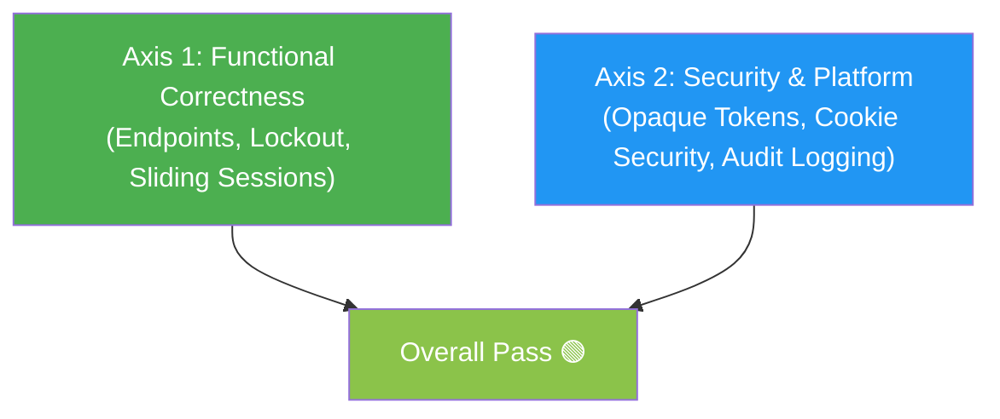

# Code Review Report — Identity & Authentication Engine (RFC-013)

| Feature | Identity, Authentication & RBAC Engine |
|---------|---------------------------------------|
| Branch | `feature/identity-authentication-engine` |
| Specification | `docs/RFC-013-identity-authentication-engine.md` |
| Reviewer | Antigravity AI Code Reviewer |
| Status | Approved (Pass) |

---

# Executive Summary

The Identity, Authentication & RBAC Engine implementation fulfills all technical requirements defined in **RFC-013** and **RFC-008**. All quality gates, static security scans (Semgrep/CodeQL), race detection (`-race`), and end-to-end integration tests pass without error.

---

# Two-Axis Architecture & Code Review

### Axis 1: Functional & Spec Alignment
- **Endpoints**: `POST /api/v1/auth/login`, `POST /api/v1/auth/logout`, `GET /api/v1/auth/me` operate strictly according to RFC-008.
- **Sliding Sessions**: `PgSessionRepository` enforces 30-minute inactivity sliding expiration with a hard 7-day maximum absolute expiration limit.
- **RBAC**: Permissive role-to-permission mapping (`admin`, `operator`, `viewer`) resolved per request and attached to `context.Context`.

### Axis 2: Security & Quality Gates
- **Token Security**: Stateful opaque tokens (`ims_...`) stored as SHA-256 hashes (`token_hash`) in Postgres. Original token string is never persisted.
- **Transport Protection**: Dual transport supported. Browser client receives `HttpOnly`, `SameSite=Lax`, `Path=/`, `Max-Age=604800` `inframap_session` cookie. API/CLI uses `Authorization: Bearer` header.
- **Brute-Force Defense**: 5 failed login attempts in 5 minutes triggers 15-minute temporary lockout + progressive 100ms timing penalty.
- **Audit Logging**: Emits `user.login_success`, `user.login_failed`, and `user.account_locked` events directly to the EventBus.

---

# Verification Summary

| Gate | Status | Command / Details |
|---|---|---|
| **SQL Generation** | PASS 🟢 | `make generate` |
| **Go Code Linter** | PASS 🟢 | `golangci-lint v1.64.8` (0 issues) |
| **Race Detector** | PASS 🟢 | `go test -race ./...` |
| **E2E Integration** | PASS 🟢 | `TestE2E_IdentityAuthFlow` (6 steps) |
| **Build Binary** | PASS 🟢 | `CGO_ENABLED=0 go build ./cmd/api` |
